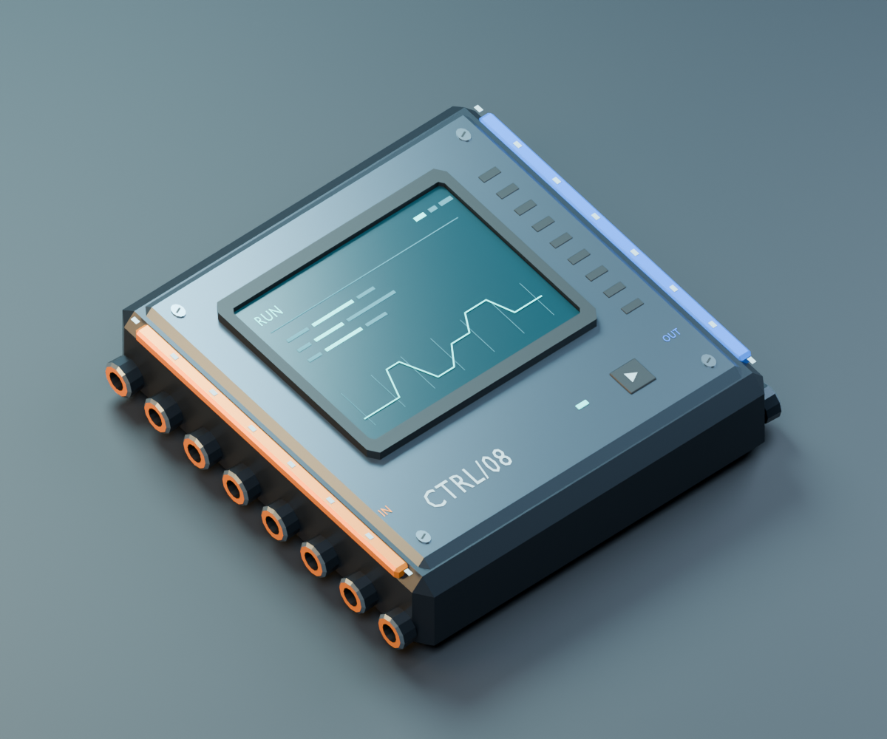

# AU-08 Lua Computer

BepInEx IL2CPP mod **0.4.4** for Approximately Up **1.0.120 / Unity 6000.4.7f1**.



- Native **AU-08 Lua Computer** item in Electronics/Math: eight inputs, eight outputs, and a larger 1 x 0.25 x 1 body.
- Full-width in-game Lua editor, starter template, per-computer programs, and up to eight simultaneously running VMs.
- Local immutable program library; copied native computers retain their program reference and fork it on edit.
- Trusted-teammate multiplayer editing and host-only Lua execution, with native output replication. **Two-player gameplay validation is still pending.**
- Computer-only execution: no scanning sidebar, F6/F7 selection, or overrides of native math blocks. Lua reads/writes the targeted computer's own ports.

This is an unofficial mod, not affiliated with ApproximatelyGames. Back up important
worlds before testing. Game binaries and generated interop assemblies are not included.

## Requirements

- Approximately Up **1.0.120**, Windows x64, Unity **6000.4.7f1**. Other builds are rejected by native compatibility checks.
- [BepInEx 6 IL2CPP bleeding edge](https://builds.bepinex.dev/projects/bepinex_be), tested with build **788**.
- **BepInEx Interop Patcher 2.0.0.0** in `BepInEx/patchers/` for the duplicate-type/unstripping issue. Use interop generated with v2, not v1.
- Launch the game once with the loader and patcher so `BepInEx/interop/` is generated, then close it before deploying.

If the loader already works, do not replace it. Build and installation instructions are below.

## Use

Use a disposable build while the new item and multiplayer lifecycle are being tested.
It uses a native Addition Array chassis and must sit on supporting structure.

1. Place **AU-08 Lua Computer**, attach input sources on the amber side and numeric data meters on the blue side.
2. Put down the building tool, aim at the computer within normal interaction reach, and press **E** (or your rebound native interact key). The editor belongs only to that computer.
3. Click **Starter template** for a working Input 1 -> Output 1 example with boolean, vector and persistent-state comments. Replacing an unsaved draft requires confirmation; the button never saves or runs it.
4. Edit and **Save in build mode**, then enter game mode. Eligible AU-08s are discovered and started automatically on the host, without selection or scanning. They stop on leaving game mode.
5. **F8** or the editor's Run/Stop controls operate on the computer last targeted with E. Manual Run requires active, unpaused game mode. **F9** stops all computers for the current flight; the next game-mode entry enables automatic startup again.

**Save in build mode for the next flight.** Native return-to-build restoration can revert a
program reference edited during flight. The immutable source file remains on disk, but
flight-to-build reference persistence still needs a dedicated fix; do not assume flight edits
are permanently attached to the build. Saving again in build mode repairs/updates that reference.

The editor offers Save, Save + Run, Run existing, Stop, Reload / Discard, and a dirty-close
confirmation. The window is reused, but **each computer has its own draft** and an identifying
`[entity:version]` in the header. Keep draft & close on A, then open B to edit B; returning to A
restores A's unsaved text. Two new computers can initially show the same starter without sharing
their edits or VM memory. Saving a copied computer forks its program reference.

Up to 64 inactive dirty drafts plus the current draft are retained in memory. Unsaved drafts
are not evicted silently; at the limit, opening a new document requires copying/discarding the
current draft. Documents are scoped to the loaded world and source authority: save before
world reload or game exit, because this is not durable draft storage. Gameplay input is captured
while editing and restored after closing keys/buttons
are released. Pause retains VM state and executes no Lua ticks. Native distance-culling likewise
pauses the affected computer without resetting its memory. Rewind stops VMs without overwriting
restored native values. Explicit Stop and script faults are not automatically retried within a flight.

**Replace/reconnect any early preview computer placed using the old label-sized chassis.**
This includes 0.2.x units: the body, collider, support polygons and all port positions have changed.
Allow room for the larger footprint. No old ship or cable is
automatically moved or repaired.

### Coding Controls

- **Tab / Shift+Tab:** indent/unindent four spaces, including selected lines.
- **Enter:** preserve indentation and indent after simple Lua block headers.
- **Ctrl+Space:** request suggestions; identifier prefixes also show suggestions automatically.
- **Up/Down, Tab/Enter, Escape:** select/insert/dismiss a suggestion. Tab indents when no suggestion is active.
- **Ctrl+Z / Ctrl+Y / Ctrl+Shift+Z:** undo/redo, up to 32 steps.

Completion includes Lua keywords, the actual allowed computer/math API, and lexical identifiers
in the draft. It is not a language server or scope/type analysis. Comments and strings do not
trigger completion; no code is executed to generate suggestions.

Sockets now use native 0.125 spacing and matching glyph dimensions. The native port anchor
is inset 0.0625 from its visible socket mouth; runtime checks compare converted transforms
against the actual mesh-ring centers, not just matching input configuration values.
Tooltips are **Input 1-8** and **Output 1-8**, matching the one-based Lua API.

## Multiplayer

1. Every player must install the same **0.4.4** plugin, MoonSharp DLL and computer assets, with working IL2CPP BepInEx/Interop Patcher, **before joining**. The custom prefab is not vanilla-compatible.
2. The host owns the program library and executes Lua. Clients receive native scalar output and program-reference events; they never start a second VM.
3. All admitted, authenticated teammates are trusted to use E and **Save**, **Save + Run**, **Run existing**, **Stop**, and **F9 Stop all**. Do not use this policy in an untrusted/public lobby.
4. A client waits for the compatible host handshake and matching source/reference before editing. Source is cached only in memory; client-local files are never substituted for missing host code.
5. Save sends a whole draft with its expected revision. Conflicting edits are rejected rather than merged/overwritten. Keep the draft, reload and merge manually. A saved program whose Run fails remains saved, and the reply explicitly reports that partial outcome.

Opening, viewing and saving without Run do not immediately execute code. Entering game mode
automatically starts eligible AU-08 host programs, including loaded/copied computers. Explicit
teammate Run/Save+Run during game mode also authorizes host execution. Stop takes
priority over pending Run requests, but cannot undo a tick already executed before it arrives.
Commands are not automatically retried after a timeout; refresh to determine the outcome.

The editor uses a separate bounded Steam Messages channel, not new native packet IDs or
the game's receive queue. Compatibility is checked after connection; this is **not** a
pre-join gate protecting clients that lack the custom prefab. Output updates are changed-only
at up to 60 batches/second per computer, with a one-second refresh and the native initial-join
sync path. The editor channel polls at 20 Hz with peers, 4 Hz in solo; this does not set Lua's
simulation rate. Remote source snapshots refresh at most once per second for the selection.

Native factories/interface/empty receive are tested, but actual two-account handshake,
source exchange, output delivery and join/rejoin behavior still require a disposable multiplayer test.

## Programs and Persistence

Plugin directory, relative to your Approximately Up installation:

```text
BepInEx/plugins/ApproximatelyUpComputer/
```

- `computer.lua` is the local initial template for unprogrammed computers. Existing nonempty edits are preserved. If absent/empty, a built-in starter is used in memory without creating/replacing the file. The editor's Starter template button always offers the documented built-in example.
- `scripts/<12-hex-ID>.lua` stores immutable source versions. Saving creates a fresh file before changing a computer's reference.
- Native AU-08s store that ID through the game's existing class-35 label data. Lua source is **not** embedded in native saves/blueprints.
- Old `legacy` bindings remain untouched on disk but are no longer used for execution or editor targeting.
- Keep the local `scripts` directory with any backed-up save containing computers. A native blueprint alone is not a portable program package.
- Game-mode entry automatically runs eligible native computers on the host, up to eight VMs. A missing or malformed saved reference is refused instead of falling back to unrelated code. Only genuinely unprogrammed computers use the initial template.
- Source identity/port changes, deletion, world changes, rewind, and script failure stop/reset affected VMs. Lua RAM/state is not serialized.

The native serializer's output and ECS copy/reference isolation have been tested. A complete
native file save/load or blueprint import roundtrip has **not** yet been tested; do not treat
important saves as the test fixture. Removing the mod from a save containing its custom prefab
is not a supported migration.

## Lua API

```lua
function tick()
    state.count = (state.count or 0) + 1
    output(1, input(1) * 2)
    output(2, input_bool(2))
    output_vec3(3, input_vec3(3))
end
```

| API | Meaning |
| --- | --- |
| `input(i)` | Numeric input, one-based index |
| `input_bool(i)` | `input(i) >= 0.5` |
| `input_vec3(i)` | x/y/z from three consecutive scalar inputs |
| `output(i, value)` | Number or boolean converted to 0/1 |
| `output_vec3(i, vector)` | x/y/z to three consecutive scalar outputs |
| `dt`, `tick_id` | Simulation step duration and native tick counter |
| `state` | Isolated per-VM Lua table, retained until reset/stop/failure |

Successful ticks default unwritten outputs to zero. Explicitly stopping an AU-08 queues
zero outputs for the next safe tick. Native math blocks are never overridden. Rewind leaves
the game's restored values intact. Clients never write Lua outputs; authority loss discards VMs without overwriting remote/restored state.
Unexpected native commit failures are not transactionally rolled back.

Numbers, booleans and vector adapters are supported. Native cables still carry scalar floats;
vectors use three wires. General string/table cable transport remains future work.

## Limits and Diagnostics

- Trusted Lua only, including code submitted by admitted teammates; no CLR, Unity, file/network, loaders, random, debug or coroutine API.
- Source is limited to 16,384 characters. Initialization and each tick allow 10,000 VM instructions and 4 MiB measured allocation.
- No hard retained-heap quota or hostile-code isolation. Parsing and individual host/VM operations cannot be preempted.
- Native float32 range is `[-1e20f, +1e20f]`. Invalid values, camera encodings and changed bindings are refused.
- The HUD shows the latest mod tick duration, input values and output values.
- Controlled 8-port validation/Lua/write timing was approximately **0.30–0.33 ms per step**, excluding real-world job wait. This is not a full-ship performance guarantee.
- Source packets are capped at 64 KiB including encoding; uncommon control-heavy source may exceed this before the 16,384-character limit. No truncation, compression, or arbitrary file transfer.
- Multiplayer is an experimental implementation, not a claim of hostile-code isolation or a full audit of the native game's peer authorization.

If inputs show zero, confirm supporting structure and actual nonzero input signals. Use a
numeric data meter, not a camera monitor. The earlier non-shared-world refusal was fixed;
the game's `ServerOpen` status and save-sharing checkbox do not mean another player is present.
If E still fails, press it once while aiming at the computer with an empty hand and inspect
`BepInEx/LogOutput.log` for `AU-08 INTERACT`. This reports the native target and rejection
reason without logging source. The E/input-memory fix was user-confirmed in 0.4.2 in both
build and game mode. If an old version left the native label assigned, one E releases that
owned assignment; aim and press E again after the native ray refreshes. If the program reference
is invalid, explicitly enter a script and Save in build mode; no automatic repair overwrites it.

## Build and Install

Use the **.NET 8 SDK** (or newer) and **PowerShell 7**. The plugin targets .NET 6 to
match BepInEx's bundled runtime; that target is end-of-support, so expected SDK warnings
are not suppressed. NuGet restores MoonSharp. Native references come from your own game
installation; never copy them into the repository.

From the repository root, substitute your actual Steam library path:

```powershell
$game = 'D:\SteamLibrary\steamapps\common\Approximately Up'
dotnet build .\src\ComputerMod.csproj --configuration Release "-p:GamePath=$game"
pwsh -NoProfile -File .\Deploy.ps1 -GamePath $game
```

Alternatively, set `APPROXIMATELY_UP_GAME_PATH` in your environment. The explicit
`GamePath` argument takes precedence. The existing `G:\SteamLibrary\steamapps\common\Approximately Up`
default is retained for local development, but is not required.

`Deploy.ps1` builds and installs the mod, MoonSharp, license notices and runtime assets
under `BepInEx/plugins/ApproximatelyUpComputer/`. It refuses a running game, verifies
copies, backs up previous mod files under the ignored `backups/` directory, and preserves
existing `computer.lua`, script libraries and bindings. It does not install/replace the
loader or patcher, load a world, or edit saves. Restart the game after deploying.

## Tests

These public tests require no game installation or extracted assemblies. Install the
.NET 8 SDK and .NET 6 runtime (or SDK) to run both target frameworks:

```powershell
dotnet run --project .\tests\LuaChecks.csproj --configuration Release
dotnet run --project .\tests\LuaEditingChecks.csproj --configuration Release
```

They cover **213 Lua/authority/storage/template checks** and **182 editing checks**.
The GitHub Actions workflow runs these same commands, not a plugin build requiring
proprietary references. Blender asset verification is documented in [assets/README.md](assets/README.md).

Local development also used native startup/clone/serialization/output probes and
additional stubbed integration tests. Those machine-specific research harnesses and
game-derived dumps are deliberately excluded from this repository. They are not a
dependency of the public build/tests. User gameplay confirmed E, saving, Output 1,
automatic launch and teardown. Two-computer native widget/IME switching, flight-edit
restoration, full save/load/import, extended culling/rewind, rebound keys, long-scene
performance and actual two-player delivery still need further validation.

## Repository Contents

- `src/`: plugin, native adapters, editor, networking and bounded Lua runtime integration.
- `tests/`: portable managed checks.
- `assets/`: authored AU-08 Blender library, exporter/verifier, runtime mesh and icons.
- `computer.lua`: initial example, copied only when an installed template does not exist.
- `Deploy.ps1`: build and install helper.
- `HOW-IT-WORKS.md`: internal architecture notes for mod developers (native item clone, ECS access, Lua runtime, networking).

Research dumps, game/loader files, generated interop, player scripts/saves, local agent
notes, personal root-level Blender files, backups, build outputs and credentials are
ignored. Keep them local; do not use `git add -f` to publish them. Distribute built mod
files separately from source, with the license notices, and never include game DLLs.

## License

Original mod code, documentation and AU-08 assets are available under the [MIT license](LICENSE).
[MoonSharp 2.0.0](https://www.moonsharp.org/) uses its upstream BSD-style three-clause
license, not this project's MIT license. See [THIRD_PARTY_NOTICES.md](THIRD_PARTY_NOTICES.md)
for the exact notices and external-reference boundary.
